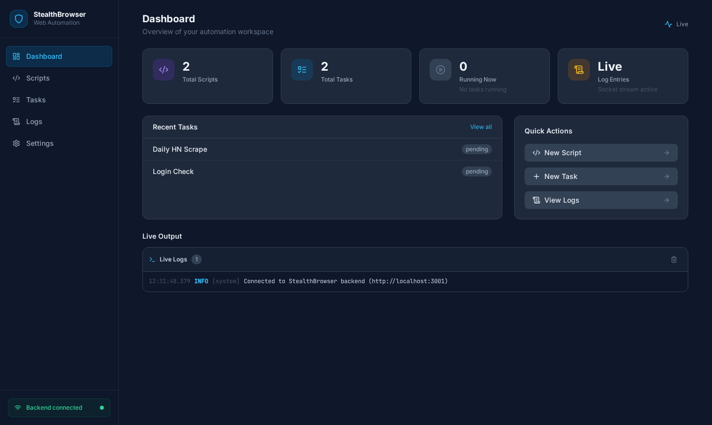
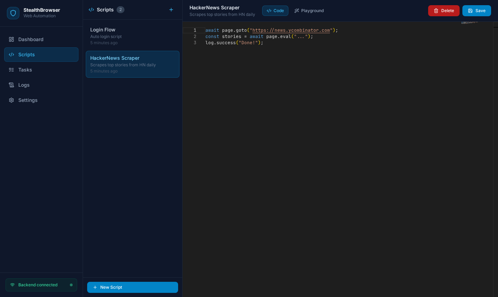
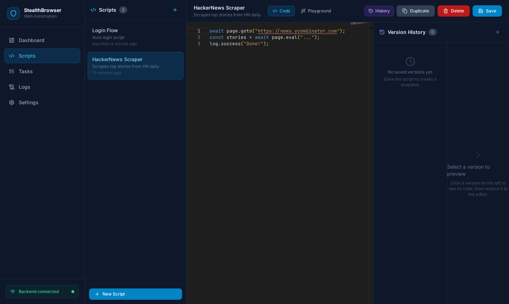
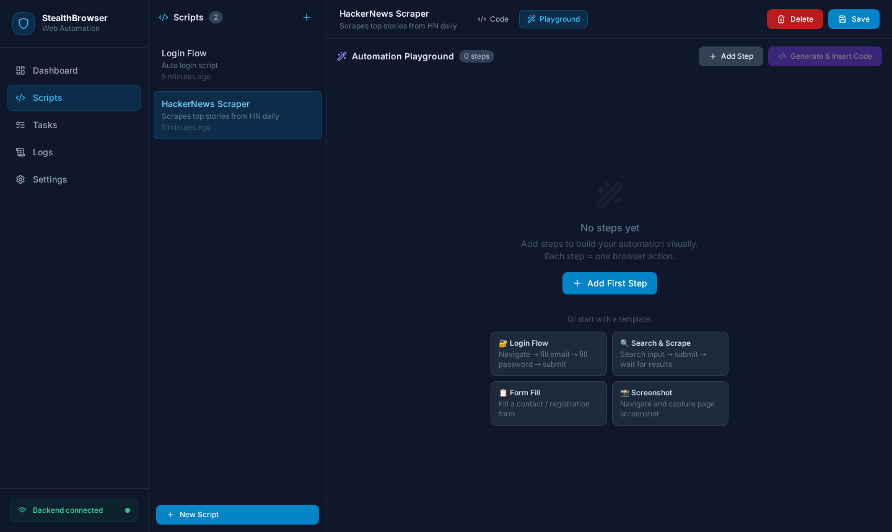
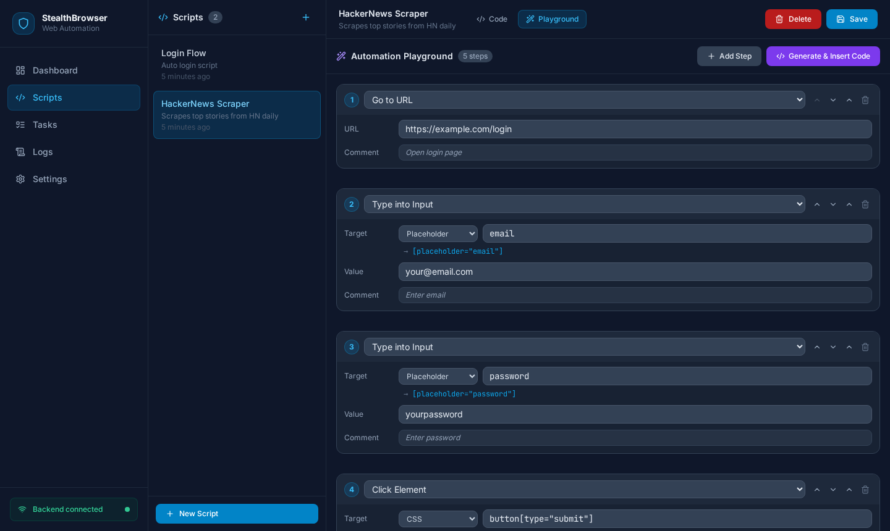
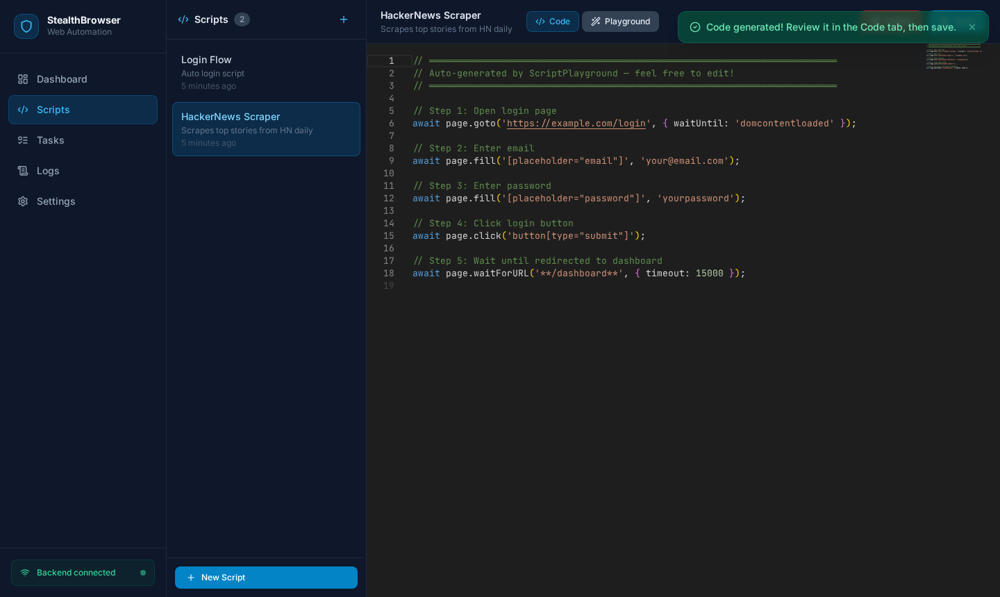
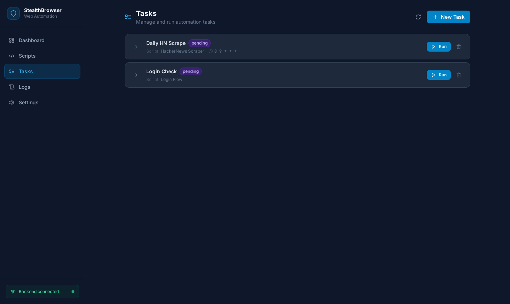
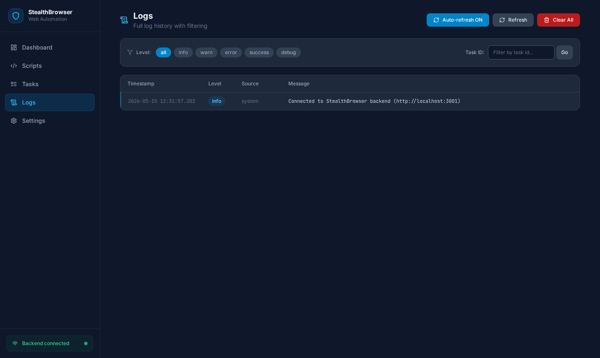
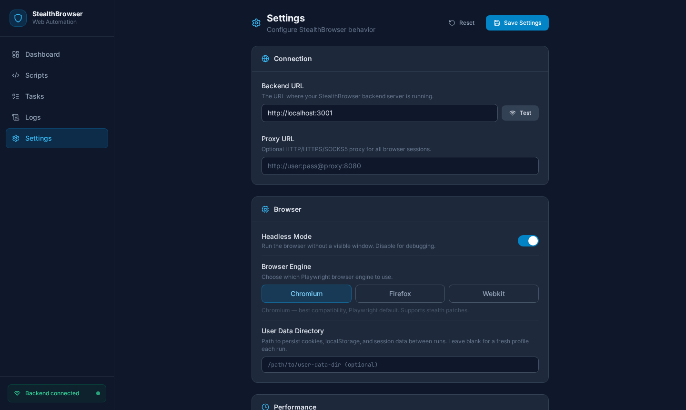

# 🕵️ StealthBrowser

> **Personal web automation platform** — Write scripts, bypass bot detection, schedule tasks, and watch live logs stream to your dashboard.

Built with **Playwright stealth** (bypasses CAPTCHAs & anti-bot systems), a **VS Code–style editor** in the browser, real-time **Socket.IO log streaming**, a **task scheduler** with cron support, and a **visual Automation Playground** to build scripts without writing code.

---

## 📸 Screenshots

### Dashboard — Stats, live logs, quick actions


### Scripts — VS Code Monaco Editor in the browser


### Scripts — Version History panel (History + Duplicate buttons)


### 🪄 Playground — Visual Automation Builder (empty state)
> Select a template or add steps manually — no coding required


### 🪄 Playground — Steps configured (Login Flow template)
> Each step = one browser action. Pick the action, select the target element, add a comment.


### 🪄 Playground — Generated Code
> Click "Generate & Insert Code" → clean, commented JavaScript appears in the editor


### Tasks — Scheduler with run/stop controls


### Logs — Full log history with filtering


### Settings — Browser engine, headless toggle, proxy


---

## ✨ Features

| Feature | Description |
|---|---|
| 🕵️ **Anti-Detect Browser** | Playwright + stealth plugin — randomized fingerprints, user agents, viewports, canvas noise |
| 📝 **Monaco Script Editor** | Full VS Code editor in the browser — JS syntax highlighting, autocomplete |
| 🪄 **Visual Playground** | Build automation flows visually — 24 actions, 7 selector methods, live preview, 4 templates |
| 🕐 **Version History** | Auto-snapshot on every save — restore any previous version with one click |
| 📋 **Duplicate Script** | Clone any script instantly as a starting point |
| ⏰ **Task Scheduler** | Run scripts immediately or on a cron schedule |
| 📡 **Live Log Streaming** | Real-time logs via Socket.IO — color-coded info/warn/error/success |
| 🖼️ **Screenshot API** | Capture page screenshots on demand |
| 🗄️ **SQLite Storage** | Zero-setup persistent storage — no database server needed |
| 🐳 **Docker Ready** | One command to run everything |
| 🔌 **Full REST API** | Control everything programmatically |

---

## 🪄 Script Playground

The Playground lets you **build browser automation visually** — no JavaScript knowledge needed.

**How it works:**
1. Go to **Scripts** → select or create a script → click the **Playground** tab
2. Add steps by clicking **+ Add Step** (or pick a ready-made template)
3. For each step, choose an **action** and set the **target element**
4. Click **Generate & Insert Code** — clean JS appears in the Code editor
5. Review, edit if needed, then **Save**

**24 actions across 5 groups:**

| Group | Actions |
|---|---|
| 🌐 Navigation | Go to URL, Go Back, Reload, Wait for URL |
| 🖱️ Mouse | Click, Double Click, Hover, Scroll to Element, Scroll Page |
| ⌨️ Input | Type into Input, Press Key, Select Dropdown, Check/Uncheck, Clear, Upload File |
| ⏳ Wait | Wait for Element, Wait Until Hidden, Sleep, Wait Network Idle |
| 📊 Data | Read Text, Get Attribute, Screenshot, Log Message |

**7 element targeting methods:**

| Method | Example input | Builds |
|---|---|---|
| CSS | `.btn-primary` | `.btn-primary` |
| ID | `login-btn` | `#login-btn` |
| Text Content | `Sign In` | `text=Sign In` |
| data-testid | `submit-button` | `[data-testid="submit-button"]` |
| Placeholder | `Enter email` | `[placeholder="Enter email"]` |
| XPath | `//button[text()="Go"]` | `xpath=//button[text()="Go"]` |
| ARIA Role | `button:Submit` | `role=button[name="Submit"]` |

> 💡 A **live selector preview** shows the exact Playwright selector as you type.

---

## 🚀 Quick Start

### Option 1: Docker (Recommended)

```bash
git clone https://github.com/mraktrader7/stealth-browser.git
cd stealth-browser
docker-compose up --build
```

Open: **http://localhost:5173** ✅

---

### Option 2: Manual Setup

**Requirements:** Node.js 18+, npm

#### Backend
```bash
cd backend
npm install
npx playwright install chromium
cp .env.example .env
mkdir -p data
npm run dev
# ✅ Running on http://localhost:3001
```

#### Frontend *(new terminal)*
```bash
cd frontend
npm install
npm run dev
# ✅ Running on http://localhost:5173
```

Open: **http://localhost:5173** 🎉

---

## 📖 How to Use

### 1️⃣ Write a Script

**Scripts → + New Script**

Your script is plain JavaScript. These globals are auto-injected:

```javascript
// ── Globals available in every script ──────────────────────────────────────
// page        Playwright Page  (anti-detect, stealth mode)
// browser     Playwright Browser instance
// log(msg)    Stream logs to dashboard  →  info level
// log.info / log.warn / log.error / log.success
// sleep(ms)   await sleep(1000) helper
// console     routes to log panel

// ── Example 1: Scrape a page title ─────────────────────────────────────────
await page.goto('https://example.com');
const title = await page.title();
log.success(`Page title: ${title}`);

// ── Example 2: Fill & submit a form ────────────────────────────────────────
await page.goto('https://httpbin.org/forms/post');
await page.fill('input[name="custname"]', 'John Doe');
await page.click('button[type="submit"]');
log.success('Form submitted!');

// ── Example 3: Scrape multiple items ───────────────────────────────────────
await page.goto('https://quotes.toscrape.com');
const quotes = await page.$$eval('.quote .text', els =>
  els.map(e => e.textContent.trim())
);
log.info(`Found ${quotes.length} quotes`);
quotes.slice(0, 5).forEach((q, i) => log.info(`${i+1}. ${q}`));

// ── Example 4: Login to a site ─────────────────────────────────────────────
await page.goto('https://example.com/login');
await page.fill('#email', 'user@example.com');
await page.fill('#password', 'mypassword');
await page.click('button[type="submit"]');
await page.waitForNavigation();
log.success('Logged in!');

// ── Example 5: Extract JSON from API ───────────────────────────────────────
await page.goto('https://jsonplaceholder.typicode.com/todos/1');
const body = await page.textContent('pre');
const todo = JSON.parse(body);
log.success(`Todo: ${todo.title} (done: ${todo.completed})`);
```

---

### 2️⃣ Create a Task

**Tasks → + New Task**

| Field | Description |
|---|---|
| **Name** | Label for this task |
| **Script** | Pick one of your saved scripts |
| **Cron Expression** | *(optional)* Schedule it to run automatically |

**Cron examples:**
```
*/5 * * * *         → every 5 minutes
0 * * * *           → every hour
0 9 * * 1-5         → weekdays at 9 AM
0 0 * * *           → daily at midnight
*/30 9-17 * * 1-5   → every 30 min during business hours
```

---

### 3️⃣ Run & Watch Logs

| Action | How |
|---|---|
| ▶ **Run now** | Click ▶ on any task |
| ⏹ **Stop** | Click ⏹ on a running task |
| **Live logs** | Dashboard → Live Output panel |
| **History** | Logs page — filterable, paginated |

---

## 🛡️ Anti-Detect Protections

Every browser session automatically applies:

| Protection | Details |
|---|---|
| **Stealth Plugin** | `puppeteer-extra-plugin-stealth` — patches 10+ fingerprint leaks |
| **User Agent Rotation** | Real Chrome + Firefox UA pool, rotated per session |
| **Viewport Randomization** | 1366×768 → 1920×1080 — changes every session |
| **Locale + Timezone Spoof** | Random en-US/GB/CA/AU + US/Europe timezones |
| **Canvas Noise** | Prevents canvas fingerprinting |
| **Hardware Spoofing** | `hardwareConcurrency`, `deviceMemory` randomized |
| **WebDriver Flag Removed** | `navigator.webdriver = false` |
| **Plugin List Spoof** | Fake PluginArray to mimic real browser |
| **Accept-Language Headers** | Randomized to match locale |
| **Automation Flags Disabled** | `--disable-blink-features=AutomationControlled` |

---

## 🔌 REST API

### Health
```
GET  /api/health
```

### Scripts
```
GET    /api/scripts           list all
POST   /api/scripts           create  { name, description, content }
GET    /api/scripts/:id       get one
PUT    /api/scripts/:id       update
DELETE /api/scripts/:id       delete
```

### Tasks
```
GET    /api/tasks             list all
POST   /api/tasks             create  { name, script_id, cron_expression? }
GET    /api/tasks/:id         get task + logs
POST   /api/tasks/:id/run     run immediately
POST   /api/tasks/:id/stop    stop running task
DELETE /api/tasks/:id         delete
```

### Browser Sessions
```
POST   /api/browser/launch              { headless?, proxy? }
GET    /api/browser/sessions            list active sessions
POST   /api/browser/screenshot          { pageId }
POST   /api/browser/close/:sessionId    close session
```

### Logs
```
GET    /api/logs              paginated  { page, limit, task_id?, level? }
DELETE /api/logs              clear all
```

### Socket.IO Events
| Event | Direction | Payload |
|---|---|---|
| `log` | Server→Client | `{ task_id, level, message, timestamp }` |
| `log:global` | Server→Client | same — all tasks |
| `task:status` | Server→Client | `{ taskId, status, result?, error? }` |
| `subscribe:task` | Client→Server | `taskId` — join task room |

---

## 🏗️ Architecture

```
stealth-browser/
├── backend/
│   └── src/
│       ├── index.js                 # Express + Socket.IO server
│       ├── db/index.js              # SQLite (scripts, tasks, logs)
│       ├── routes/
│       │   ├── scripts.js           # CRUD /api/scripts
│       │   ├── tasks.js             # /api/tasks + run/stop
│       │   ├── browser.js           # /api/browser sessions
│       │   └── logs.js              # /api/logs
│       └── services/
│           ├── browser.service.js   # 🕵️ Anti-detect engine
│           └── executor.service.js  # VM sandbox runner
└── frontend/
    └── src/
        ├── pages/
        │   ├── Dashboard.jsx        # Stats + live output
        │   ├── Scripts.jsx          # Monaco editor + Playground tabs
        │   ├── Tasks.jsx            # Task manager
        │   ├── Logs.jsx             # Log history
        │   └── Settings.jsx         # Config
        ├── components/
        │   ├── ScriptPlayground.jsx # 🪄 Visual automation builder
        │   ├── VersionHistory.jsx   # 🕐 Version history + restore panel
        │   └── __tests__/           # 38 unit tests
        ├── hooks/useSocket.js       # Socket.IO hook
        └── utils/api.js             # Axios client
```

---

## ⚙️ Environment

`backend/.env`:
```env
PORT=3001
NODE_ENV=development
CORS_ORIGIN=http://localhost:5173
DB_PATH=./data/stealth.db
```

---

## 🔧 Troubleshooting

```bash
# Backend won't start — ensure data dir exists
mkdir -p backend/data

# Playwright browser missing
cd backend && npx playwright install chromium

# Port in use
kill $(lsof -ti:3001) && kill $(lsof -ti:5173)

# Frontend dependency issues
cd frontend && rm -rf node_modules && npm install
```

---

## 🛠️ Tech Stack

| | Technology |
|---|---|
| **Backend** | Node.js 18, Express 4, Socket.IO 4 |
| **Browser** | Playwright + playwright-extra + stealth plugin |
| **Sandbox** | Node.js `vm` module |
| **Scheduler** | node-cron |
| **Database** | SQLite (better-sqlite3) |
| **Frontend** | React 18, Vite 5, Tailwind CSS 3 |
| **Editor** | Monaco Editor |
| **Realtime** | Socket.IO Client |
| **Container** | Docker + docker-compose |

---

## 📝 License

MIT — use it however you want.
